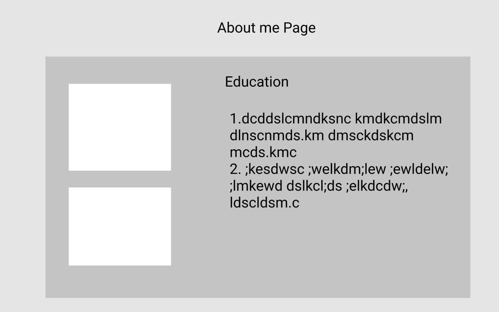
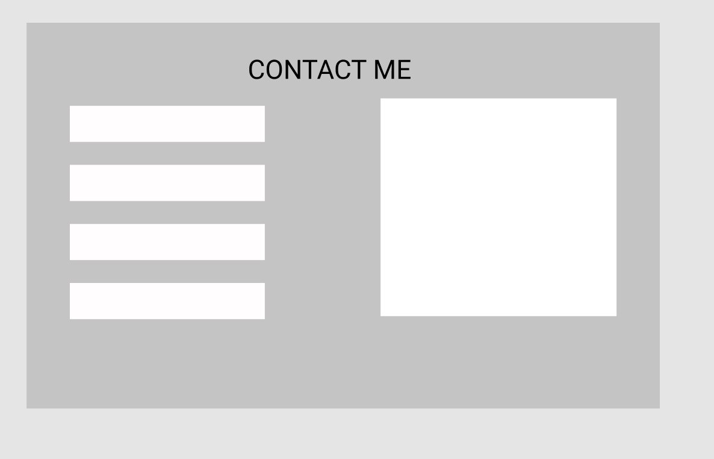

# project- 2

### PORTFOLIO WEBSITE GOALS

* You will be writing out details for the following items: 
➔ Colors for: body text, header text, link text, and background. 
➔ A simple site-map for your website. 
➔ Images and/or photos that you will be using on your portfolio. 
➔ A wireframe for each webpage. 
➔ Text content for your webpages. 
➔ Resume as a PDF file. 

### My portfolio website Introduction

    As any developer has a personal portfolio website, I also have own website 
    
    
    
    
 ### Body part of my Portfolio Website
        lorem30

### UI of my website

        lfdgkvrdk;l gd klgmk fskm;mgfk;ld
        
### Navigation bar of my website 

        kfmklefler dsmf kemfklermlkel rmktm

# project-2-meda

# About Me Page

# My Portfolio Page

# My Skills Page 

# Contact Me Page

